# Dockerized Flask App with Redis

## Overview

Built a production-grade containerized Flask application that tracks visit counts using Redis. Implemented a multi-stage Dockerfile for size optimization, hardened with a non-root user and `dumb-init` for proper signal handling. Orchestrated the Flask app and Redis using a hardened `docker-compose.yml` with healthchecks, read-only filesystems, and dropped Linux capabilities. Built the image, tagged it, and pushed it to Docker Hub for remote distribution.

## Architecture

- **Multi-stage Dockerfile**:
  - **Builder stage**: Installs compilers (`gcc`) and compiles Python dependencies into an isolated `/install` folder.
  - **Final stage**: Starts fresh with a **Debian Slim** base (switched from Alpine for stability), copies only the compiled binaries (no compilers), adds `dumb-init`, creates a non-root user (`appuser:1001`), and locks down the filesystem.
- **Docker Compose Orchestration**:
  - Custom bridge network (`app-network`) for container-to-container communication.
  - Flask service built from the local Dockerfile with environment variables (`REDIS_HOST=redis`).
  - Redis service using `redis:7-alpine` with a healthcheck (`redis-cli ping`).
  - Security hardening: `read_only: true` (root FS), `tmpfs:/tmp` (writable temp space), `cap_drop: ALL` (drop all Linux capabilities).
- **Docker Hub Distribution**: Tagged as `ziqkimi/docker-app-flask:latest` and `v1.0`, pushed to Docker Hub for easy deployment anywhere.

## Tech Stack

- **Language**: Python (Flask)
- **Dependencies**: `flask`, `redis`, `pytest` (pure Python—no compiled C-extensions required)
- **Container Tools**: Docker, Docker Compose
- **Base Images**: `python:3.11-slim` (Debian-based, both stages), `redis:7-alpine`
- **Utilities**: `dumb-init` (signal handling), `redis-cli` (healthchecks)

## Project Structure

```
docker-app-flask/
├── Dockerfile              # Multi-stage build (builder + final)
├── docker-compose.yml      # Hardened orchestration (flask + redis)
├── app.py                  # Flask app: / (counter) and /health
├── requirements.txt        # flask, redis, pytest
└── .dockerignore           # Excludes unnecessary files from build context
```

## How to Run

```bash
# Clone the repository
git clone https://github.com/ziqkimi308/docker-app-flask.git
cd docker-app-flask

# Build and run with Docker Compose (auto-builds image, starts both containers)
docker compose up --build

# Access the app at http://localhost:5000
# Visit count increments on each refresh.

# Run standalone (without Compose, requires local Redis running)
docker run -d --name flask-app -p 5000:5000 -e REDIS_HOST=localhost docker-app-flask:latest

# Pull and run the image directly from Docker Hub
docker run -d --name flask-from-hub -p 5001:5000 ziqkimi/docker-app-flask:latest

# Tear down the Compose stack
docker compose down -v   # -v removes volumes (clears Redis data)
```

## Problems Faced & Fixes

**Issue 1: Alpine vs. Debian Slim Migration (The Great Base Image Swap)**
<br/>The original guide used `python:3.11-alpine`, but Alpine uses `musl` (a lightweight C library) and the `apk` package manager. This made installing tools like `dumb-init` and managing compilers more complex. I switched to `python:3.11-slim` (Debian-based) for better compatibility.

**Investigation & Fix:**
<br/>Switching base images required changing the package manager syntax across both stages:
- `apk add --no-cache` → `apt-get update && apt-get install -y --no-install-recommends ... && rm -rf /var/lib/apt/lists/*`
- `addgroup -S appgroup && adduser -S appuser -G appgroup -u 1001` (Alpine) → `useradd -m -u 1001 appuser` (Debian)
- `&& rm -rf /var/lib/apt/lists/*` was added after each `apt-get` install—this is the Debian equivalent of Alpine's `--no-cache`, clearing the package index cache to keep the image small.

**Root cause:**
<br/>Mixing Alpine (`apk`) and Debian (`apt-get`) package managers across stages, or switching base images without updating the accompanying system commands, breaks the build. The builder and final stages must stay consistent.

**Issue 2: The Mystery of the `gcc` Compiler ("Do we actually need this?")**
<br/>The builder stage installed `gcc` (a C compiler). Looking at `requirements.txt` (`flask`, `redis`, `pytest`), these are **pure Python packages**—they contain no C code and require no compilation.

**Root cause & Decision:**
<br/>`gcc` sits completely unused during the build for this specific project. However, I kept it as a **defensive default**—a "just in case" measure for future dependencies (e.g., `psycopg2`, `cryptography`, `numpy`) that *do* require compiling C-extensions. It costs a bit of image size but prevents a broken build later if the `requirements.txt` changes.

**Fix:**
<br/>Documented this in the Dockerfile with a comment:
```dockerfile
# Defensive default: not required by current pure-Python deps,
# but avoids future build breaks if a compiled dependency gets added.
```

**Issue 3: Docker Hub Pull Fails with "Port is already allocated"**
<br/>When testing the pulled image from Docker Hub with `docker run -d --name flask-from-hub -p 5000:5000 ziqkimi/docker-app-flask:latest`, I got a `Bind for 0.0.0.0:5000 failed: port is already allocated` error.

**Investigation:**
<br/>`docker ps` showed the original Compose stack still running and holding port `5000`. However, the new container failed to start and wasn't visible in `docker ps`.

**Root cause:**
<br/>`docker ps` only shows **running** containers. The failed container was created but stopped immediately due to the port conflict. It still existed and held the name `flask-from-hub`, blocking the retry.

**Fix:**
<br/>Used `docker ps -a` to see all containers (including stopped/failed ones). Removed the failed container with `docker rm flask-from-hub`, then re-ran with a different host port to avoid the collision:
```bash
docker rm flask-from-hub
docker run -d --name flask-from-hub -p 5001:5000 ziqkimi/docker-app-flask:latest
```
Visited `http://localhost:5001`—the image ran successfully (though Redis showed "unavailable" since it was running standalone without a Redis container linked, which was expected for this test).

## Screenshots

### 1. Docker & Compose Versions

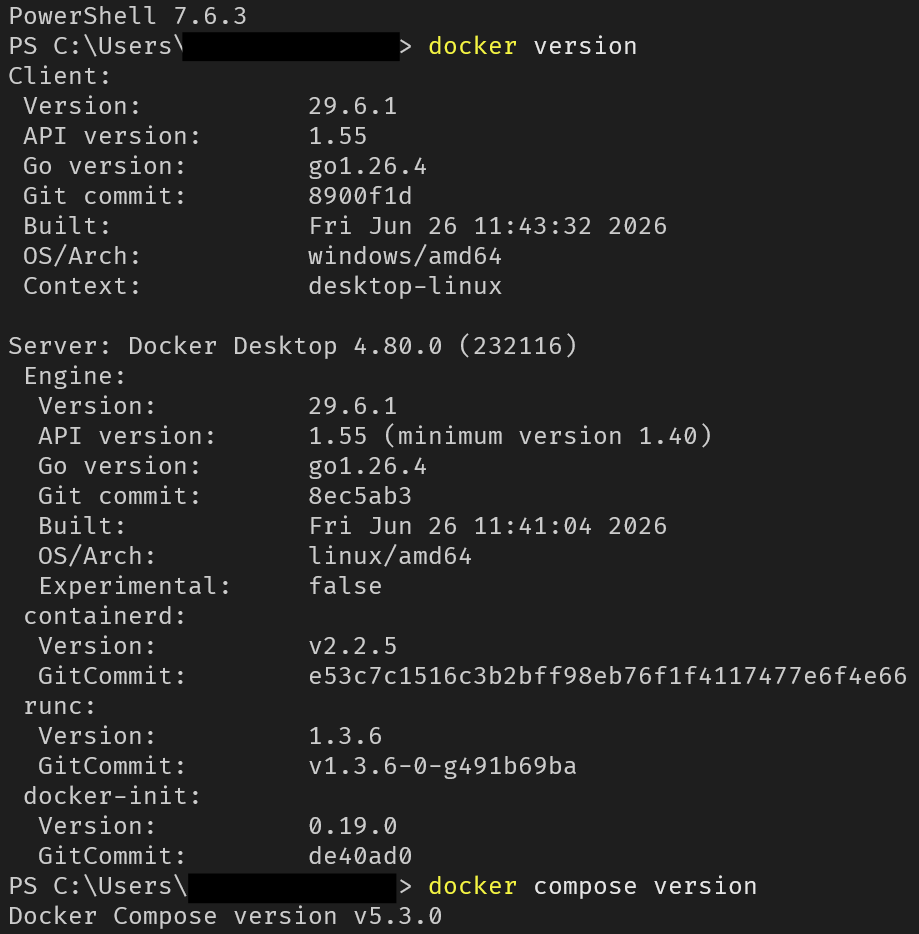

### 2. Build Success & Image Verification

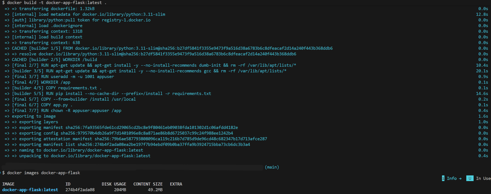

### 3. Docker Compose Up (Stack Running)

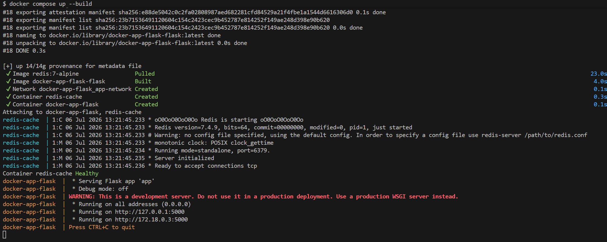

### 4. Inspecting the Custom Network

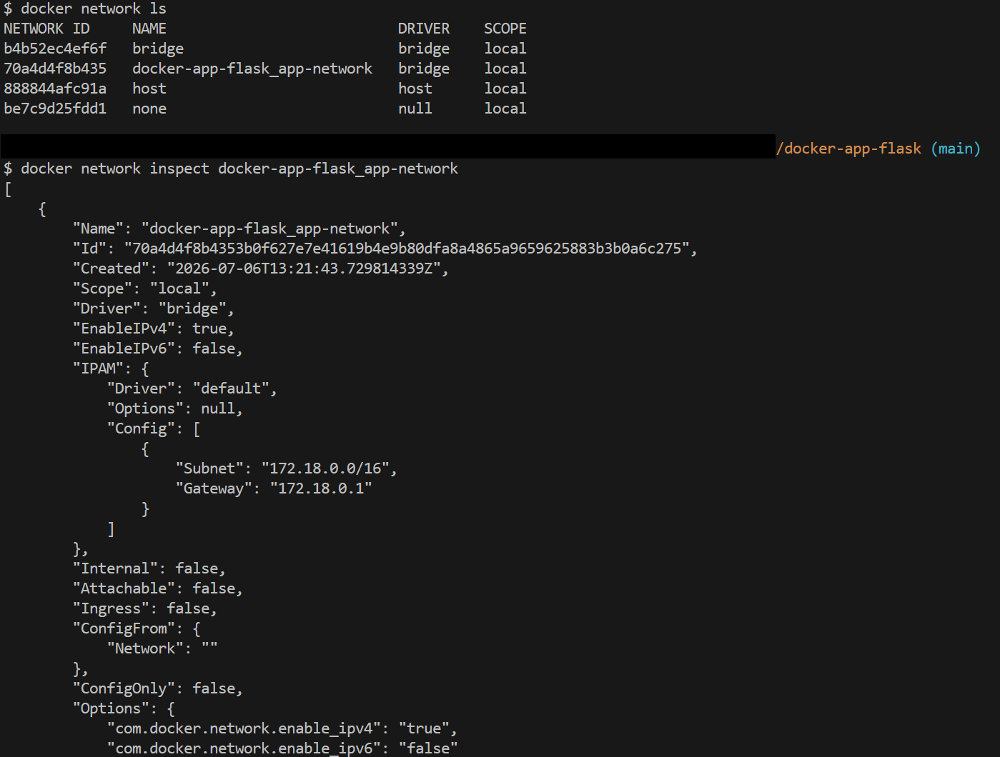

### 5. Exec into Running Container (Service Discovery Check)

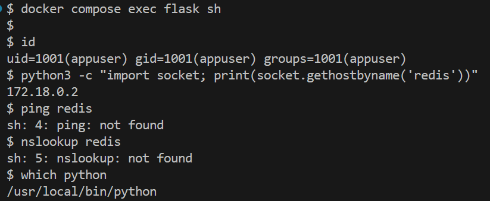

### 6. Live Logs (Flask & Redis)

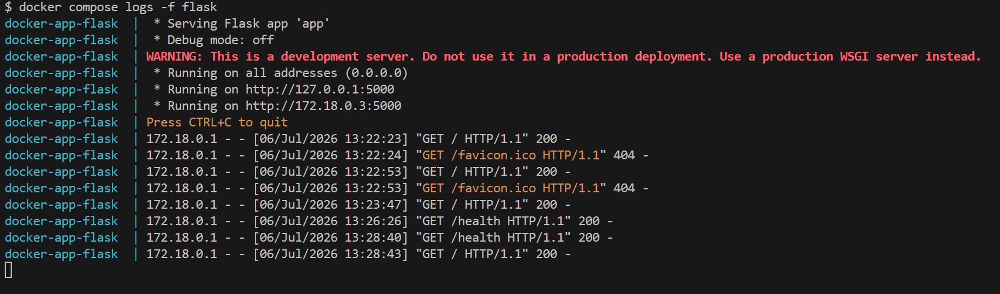

### 7. Website Working with Redis Counter

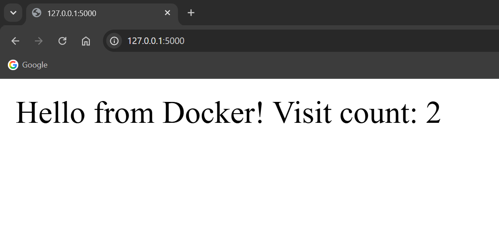

### 8. Tagging & Pushing to Docker Hub

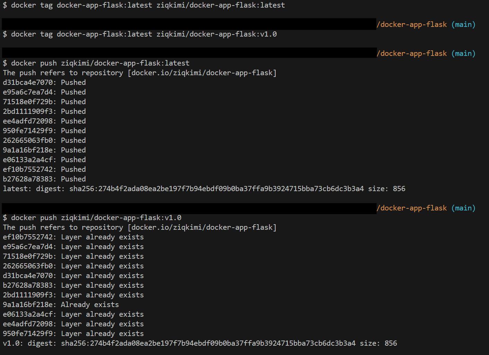

### 9. Image Verified on Docker Hub

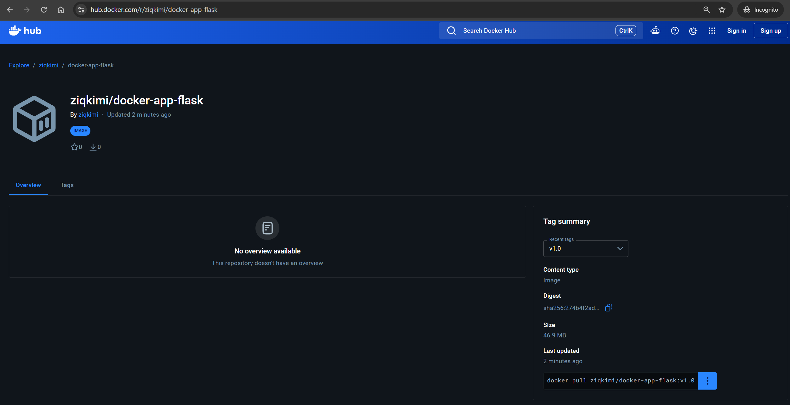

### 10. Pull and Run from Docker Hub

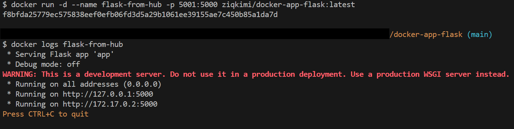

### 11. Cleanup (Down, Prune, RMI)

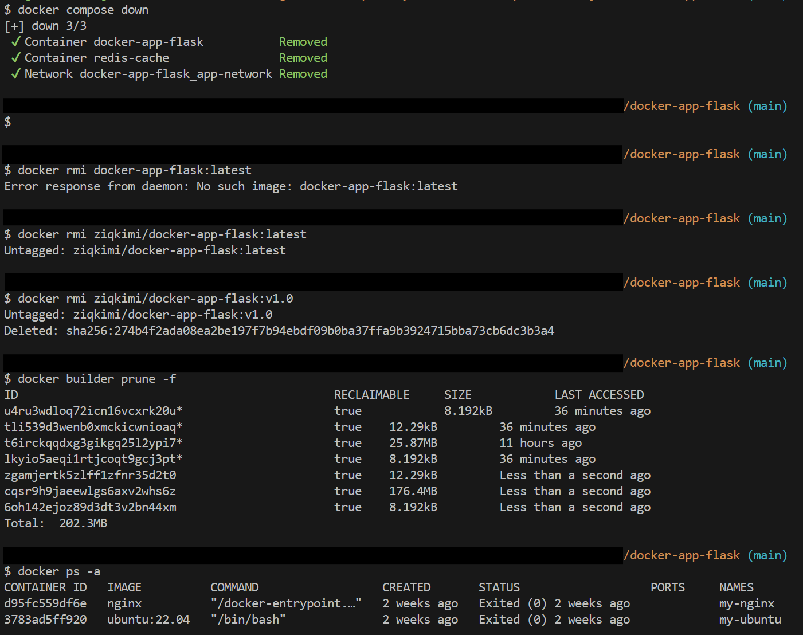

## Notes

- The builder stage installs `gcc` even though `flask`/`redis` are pure Python—this is a defensive default for future compiled dependencies, not a current requirement.
- The `read_only: true` and `tmpfs:/tmp` combo in Compose ensures the Flask container cannot write to its root filesystem, but still has a temporary space for runtime needs.
- Always use `docker compose config` to validate your YAML syntax before spinning up the stack.
- `.dockerignore` is critical to prevent accidentally sending large files (like `venv` or `__pycache__`) to the Docker daemon, which slows down builds.
- Never store secrets (API keys, DB passwords) directly in the Dockerfile or Compose file—use environment variables or Docker secrets for production.